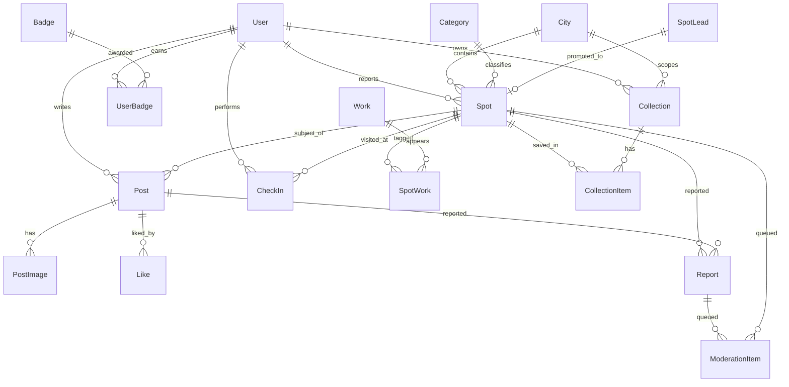

# 데이터 모델 (Data Model)

> 상위 원천: [`../prd.md`](../prd.md) §13~16·§35. 용어: [`glossary.md`](glossary.md). 이 문서는 **초안**이며 Phase 0(스키마)·각 Phase에서 확정한다. 코드 식별자는 영어.

## ERD (개념)

## Enums
- `Role`: `GUEST` | `USER` | `TRUSTED_USER` | `MODERATOR` | `ADMIN`
- `VerificationStatus`: `OFFICIAL` | `USER_VERIFIED` | `USER_REPORTED` | `ESTIMATED`
- `CollectionVisibility`: `PRIVATE` | `LINK`
- `SafetyTag`: `PRIVATE_PROPERTY` | `RAILWAY` | `ROADWAY` | `BUSINESS` (다중 선택)
- `TimeOfDay`: `DAWN` | `DAY` | `SUNSET` | `NIGHT` (추천 시간대, 다중)
- `Difficulty`: `EASY` | `MEDIUM` | `HARD`
- `ReportReason`: `WRONG_LOCATION` | `COPYRIGHT` | `PRIVACY_TRESPASS` | `INAPPROPRIATE`
- `ModerationType`: `NEW_SPOT` | `REPORT` | `OFFICIAL_CANDIDATE` | `WORK_STILL_REQUEST`
- `ModerationStatus`: `PENDING` | `APPROVED` | `REJECTED` | `MERGED` | `HIDDEN`
- `WorkType`: `ANIME` | `MOVIE` | `DRAMA` | `OTHER`

## 핵심 엔티티 (필드 초안)

### User
`id, email, role(Role), nickname, avatarUrl?, isTrusted(bool), createdAt` + Auth.js 계정 연결 테이블(Account/Session). 동의 이력: `agreedTermsAt, agreedPrivacyAt, agreedLocationAt, birthYear?`(만 14세 미만 제한 검증용).

### City
`id, name, nameEn?, country(KR|JP), centerLat, centerLng, defaultZoom, isActive`.

### Category
`id, key, label, sortOrder`. (대분류 6~7개, prd §13) + 자유 태그는 별도 `Tag`/`SpotTag`로 확장 가능(후속).

### Spot  ← 제품의 중심
필수: `id, name, categoryId, cityId, shooterLat, shooterLng, coverImageUrl, subject(text), verificationStatus, createdById, createdAt`.
선택: `subjectLat?, subjectLng?, bearing?(0-360), addressCached?, access?, tip?, timeOfDay(TimeOfDay[]), season?, lens?, difficulty?(Difficulty), crowdedness?, caution?, checkinRadiusM(default 100)`.
안전: `safetyTags(SafetyTag[])`, `isBlockedHighRisk(bool)`.
파생 집계(비정규화 캐시): `saveCount, checkinCount, uniqueCheckinCount, likeSum` (인기도 정렬용).
i18n: `name_ja?, subject_ja?`(nullable, 후속).
**불변식**: `(shooterLat, shooterLng)` = 촬영자 위치. 공간 인덱스는 raw SQL/generated `geography` 컬럼(tech-stack 참조).

### Work / SpotWork
- `Work`: `id, title, titleEn?, type(WorkType), coverImageUrl?(운영자 관리), description?`.
- `SpotWork`(다대다 조인): `spotId, workId, episode?, sceneNote?`.

### Collection / CollectionItem
- `Collection`: `id, ownerId, title, description?, visibility(CollectionVisibility default PRIVATE), isOfficial(bool default false), cityId?, coverImageUrl?, createdAt`.
- `CollectionItem`: `id, collectionId, spotId, order(int), day(int?, nullable — 후속 날짜 일정), addedAt`. **유니크**: `(collectionId, spotId)`.
- 기본함 "저장됨"은 사용자별 자동 생성 Collection(예: `isDefault`).

### Post / PostImage / Like
- `Post`: `id, authorId, spotId(필수), caption?, isVerifiedShot(bool), createdAt`. (스팟 비연결 게시물 없음)
- `PostImage`: `id, postId, url, order(0-4, 최대 5장)`.
- `Like`: `id, postId, userId, createdAt`. **유니크**: `(postId, userId)`. (좋아요는 게시물에만)

### CheckIn
`id, userId, spotId, createdAt, deviceAccuracyM, isMockSuspected(bool)`. **유니크(방문 완료)**: `(userId, spotId)` — 최초 1회만 unique 카운트. 재인증 쿨다운 24h는 애플리케이션 규칙. 원시 좌표는 저장하지 않음(결과만).

### Badge / UserBadge
- `Badge`: `id, key, type(CITY|PILGRIMAGE_COMPLETE|FIRST_REPORTER), label, description, iconUrl, criteria(json)`.
- `UserBadge`: `id, userId, badgeId, awardedAt, context(json: cityId/workId 등)`. **유니크**: `(userId, badgeId, context)`.

### Report / ModerationItem
- `Report`: `id, reporterId, targetType(SPOT|POST), targetId, reason(ReportReason), memo?, createdAt`.
- `ModerationItem`: `id, type(ModerationType), status(ModerationStatus), refType, refId, assigneeId?, note?, createdAt, resolvedAt?`. 반복 신고 임계 초과 시 대상 자동 임시 숨김(임계값 TODO).

### SpotLead  ← 외부 시딩 (⚠️ 법률 검토 필요, prd §41)
`id, sourceUrl, sourcePlatform(INSTAGRAM|THREADS|YOUTUBE|BLOG|OTHER), placeName?, lat?, lng?, note?, status(PENDING|VERIFIED|REJECTED), promotedSpotId?, createdAt`.
**규칙**: 원본 이미지/영상은 저장하지 않는다. 좌표·장소명·출처 URL 등 **메타데이터만**. 운영자 검증 후 `Spot`으로 승격.

## 인덱스/성능 메모
- `Spot`: 공간 인덱스(geography), `cityId`, `categoryId`, `verificationStatus`.
- `Post`: `spotId`, `authorId`, `createdAt`. `Like`: `(postId,userId)` 유니크.
- 인기도 정렬은 파생 집계 캐시 + 주기적 재계산(또는 트리거). 상세는 Phase 2~4에서 확정.
